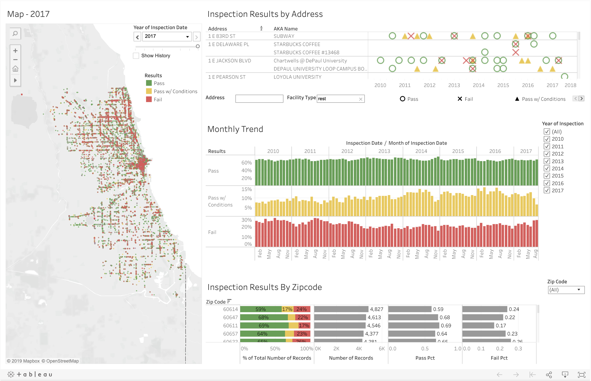

# Visualizing Chicago restaurant inspection results using Tableau

## Description

- A map of inspection results by year.
- Interactive panels of inspection results by zipcode, as well as monthly trend of inspection results.
- An address search to display quarterly inspection results for any address of interest.

## Data source

Chicago restaurant inspection data from 2010 to 2017 on [Kaggle](https://www.kaggle.com/chicago/chi-restaurant-inspections)

## Dashboard

Check out this dashboard [here](https://public.tableau.com/profile/angang.li8778#!/vizhome/restaurant_inspection/Dashboard4)

